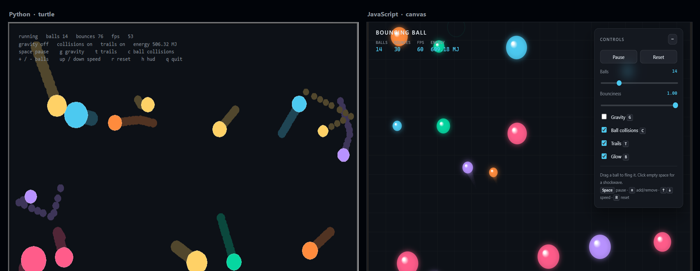

# Bouncing Ball

An elastic-collision playground in two flavours that share one model: a **Python + turtle**
desktop version and a **JavaScript + canvas** browser version. Balls reflect off the walls,
bounce off each other with conserved momentum, and drag a trail behind them.

Zero dependencies on either side — the Python version uses only the standard library, and the
web version is plain HTML, CSS and JavaScript with no build step.



<p align="center"><em>The same seed, the same fourteen balls, the same maths — one drawn with
turtle, one with canvas.</em></p>

---

## Quick start

### Browser — no install

Open `web/index.html` in any modern browser. That is the whole procedure; it works straight
off the disk, no server needed.

It carries **both** physics engines: the current vector-reflection one, and the slope-and-angle
approach this project started with. Press <kbd>E</kbd> to swap between them mid-run.

### Python — no install either

```bash
python main.py
```

Needs Python 3.9+ with `tkinter` (bundled on Windows and macOS; on Debian/Ubuntu run
`sudo apt install python3-tk`).

```bash
python main.py --balls 12 --gravity --restitution 0.85   # a bouncy ball pit
python main.py --no-ball-collisions --balls 30           # ghost balls, they pass through
python main.py --seed 42                                 # the exact same run every time
python main.py --help                                    # every option
```

---

## Controls

Both versions use the same keys.

| Key | Action |
| --- | --- |
| <kbd>Space</kbd> | Pause / resume |
| <kbd>G</kbd> | Gravity on / off |
| <kbd>T</kbd> | Trails on / off |
| <kbd>C</kbd> | Ball-to-ball collisions on / off |
| <kbd>+</kbd> / <kbd>-</kbd> | Add / remove a ball |
| <kbd>↑</kbd> / <kbd>↓</kbd> | Speed everything up / slow it down |
| <kbd>R</kbd> | Reset |
| <kbd>H</kbd> | Hide the HUD *(Python only)* |
| <kbd>B</kbd> | Glow on / off *(browser only)* |
| <kbd>E</kbd> | Swap physics engine: vector reflection / the original slope-and-angle *(browser only)* |
| <kbd>Q</kbd> / <kbd>Esc</kbd> | Quit *(Python only)* |

Mouse: **click empty space** for a shockwave that shoves every ball away from the pointer.
In the browser you can also **drag a ball and fling it** — release while moving and it keeps
the speed of your throw.

The browser version can be preset from the URL:

```
web/index.html?balls=20&gravity=1&restitution=0.85&seed=42&collisions=0&trails=0
web/index.html?engine=slope                 # boot straight into the original approach
```

---

## How the physics works

The whole simulation rests on one formula. A bounce is a **reflection of the velocity vector
about the surface normal**:

```
v_out = v - 2 (v · n) n
```

For a wall that is axis-aligned, `n` is `(±1, 0)` or `(0, ±1)`, so the formula collapses to
"flip one component and leave the other alone" — which is exactly what the code does.

**Walls.** Each frame, a ball that has crossed a boundary is first *pushed back* to the
boundary and only then has its velocity flipped:

```python
if x - radius < left:
    x = left + radius            # correct the position first
    if vx < 0:
        vx = -vx * restitution   # then reflect, if still heading out
```

Clamping before reflecting is what makes the bounce robust. A ball can never end a frame
outside the arena, so it can never get stuck vibrating inside a wall — the classic failure
of a naive "if out of bounds, flip the sign" check.

**Ball against ball.** Along the line joining the two centres, an impulse is applied that
conserves momentum for unequal masses:

```
j = -(1 + e) (v_rel · n) / (1/m₁ + 1/m₂)
```

Two details make this stable:

1. The overlap is resolved *before* the impulse, split by inverse mass so the lighter ball
   moves further out of the way.
2. The impulse is skipped when the balls are already separating (`v_rel · n ≥ 0`). Without
   that guard, touching balls get pulled back together and stick.

Mass comes from the disc area (`m = πr²`), so a big ball genuinely shoves a small one aside
instead of everything behaving like identical billiard balls.

**Time.** Both versions integrate with a fixed step and clamp how much time a single frame may
simulate, so a stall — dragging the window, a laptop waking up, switching browser tabs — cannot
teleport a ball through a wall. The browser runs a fixed-step accumulator so the simulation
behaves identically on a 60 Hz laptop and a 144 Hz monitor.

The tests assert the consequences: with `restitution = 1.0`, total kinetic energy is unchanged
after 2000 frames, and momentum is conserved through unequal-mass collisions.

**Where that formula comes from, built from nothing:** [docs/physics.md](docs/physics.md) —
vectors, normals, the dot product, and why the `2`, with a worked example at every step. It
also sets the Python and JavaScript implementations side by side, including the one place they
genuinely differ: turtle's +y points up, canvas's points down, so the two files disagree about
the sign of gravity and about nothing else.

---

## Project layout

```
main.py                  entry point: python main.py [options]
docs/
  physics.md             the formula from zero, in Python and JavaScript,
                         plus the original approach and how to fix it
  both.png               the screenshot above
legacy/
  original_fixed.py      the first slope/angle version with its bugs fixed
bouncing_ball/
  vector.py              Vec2: an immutable 2D vector (add, dot, reflect, clamp)
  bounds.py              Bounds: the rectangular arena
  ball.py                Ball: position, velocity, radius, mass, trail
  world.py               the simulation - integration and collision response
  config.py              every tunable setting in one dataclass
  turtle_app.py          the turtle renderer and the frame loop
  cli.py                 argument parsing
tests/
  test_physics.py        35 headless tests - no window is ever opened
web/
  index.html             the browser version - just open it
  styles.css
  physics.js             the same model, ported; runs in Node too
  legacy.js              the original slope/angle approach, ported too
  app.js                 canvas renderer, input, UI and the engine switch
  physics.test.js        21 tests, Node built-in test runner
  legacy.test.js         21 more, for the old engine
```

The split that matters: **`world.py` imports nothing from turtle, and `physics.js` touches no
DOM API.** That is what lets the same model run under a GUI, in a browser, and in a test runner
with no display attached.

---

## Tests

```bash
python -m unittest discover -s tests -t .   # 35 tests
npm test                                    # 42 tests: both browser engines
```

Both suites run headless in about a second and need nothing installed.

---

## What changed in the rewrite

The first version computed each bounce from the **slope of the incoming line and the angle
between two lines**, using `tan θ = (m₂ - m₁) / (1 - m₁m₂)`. It was a nice piece of coordinate
geometry, but it fought the tooling in a few ways:

| Then | Now |
| --- | --- |
| Slope-and-angle trigonometry, with `m = 999999999` standing in for a vertical wall's infinite slope | Vector reflection, `v - 2(v·n)n`, which has no special case for vertical |
| Sixteen branches: four quadrants × four walls, each repeating the same formula | One wall check per axis, four lines total |
| `while 1:` driving turtle directly — the window could not be closed or paused | An `ontimer` frame loop, so keyboard and window events still work |
| Position compared against walls with `±1` tolerance windows, so balls slipped through and stuck | Position clamped to the boundary, so escaping is impossible by construction |
| Movement of 1–2 px per iteration, so speed depended on how fast your machine ran | Velocity in px/second, integrated against real elapsed time |
| One ball, one colour, no interaction | Many balls with mass-based collisions, gravity, trails, and mouse interaction |
| A `print()` on every frame | A HUD showing ball count, bounces, fps and total kinetic energy |
| No tests | 77 tests across the implementations |

The physics is also honest now: energy is conserved to floating-point precision when
`restitution = 1.0`, and it decays predictably when you turn the bounciness down.

**The first approach was fixable, though.** The slope-and-angle maths was never wrong — 30°
into a horizontal wall really does turn the ball 60°. What failed was the *representation*:
slopes are undefined for vertical lines, and `abs()` threw away the turn direction, which is
what forced the sixteen branches. Eight changes fix it, and the two that matter most collapse
those ~190 lines to four. The fixed original runs in both languages:

```bash
python legacy/original_fixed.py       # turtle, one ball, exactly as it was
open web/index.html?engine=slope      # the same approach, on canvas
```

**Both engines ship in the browser demo.** The old approach is a second physics core
(`web/legacy.js`) that the renderer can swap to while it runs: pick it from the **Engine**
dropdown or press <kbd>E</kbd>. Same arena, same renderer, same ball count carried across —
only the maths underneath changes.

Two things make the difference visible. A **heading** readout appears in the HUD, because a
single angle in degrees is the old engine's entire state where the new one carries a velocity
vector. And the controls the original had no notion of — gravity, bounciness, ball-to-ball
collisions — grey themselves out, so leave several balls running and watch them pass straight
through each other. Switch back and your settings return.

The post-mortem and the fixes are Part B of [docs/physics.md](docs/physics.md). The punchline:
reflecting a turtle heading off a wall at angle `w` is `h_out = 2w - h`, which is
`v - 2(v·n)n` written in angles — the same answer, every time.

---

## Ideas worth trying

- Sound on impact, pitched by collision speed.
- Spin and friction, so balls roll along the floor instead of sliding.
- A spatial grid, so hundreds of balls do not cost O(n²) pair checks.
- Angled or moving walls — the reflection formula already handles any normal you give it.

Comments and suggestions are welcome.
